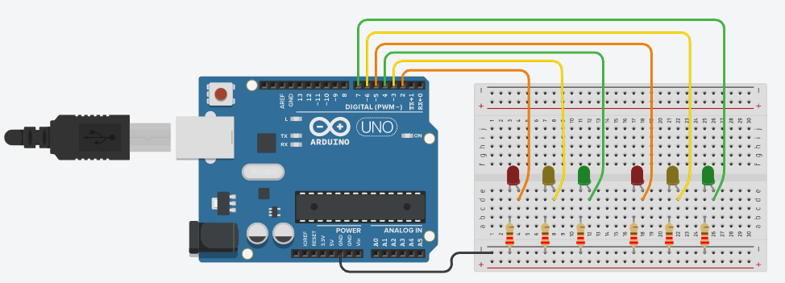
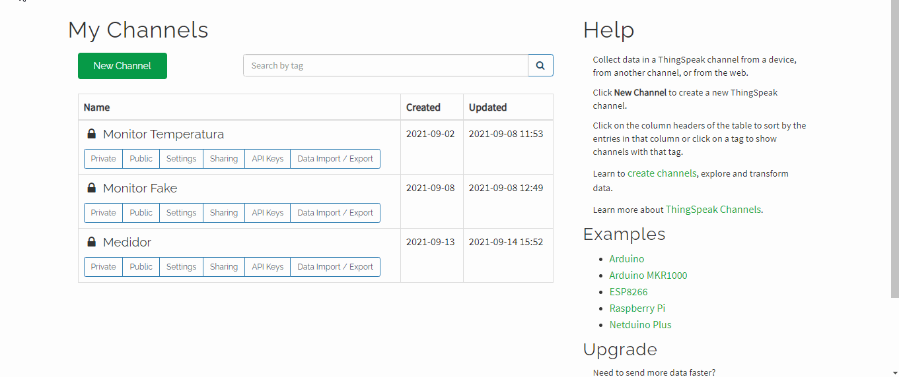
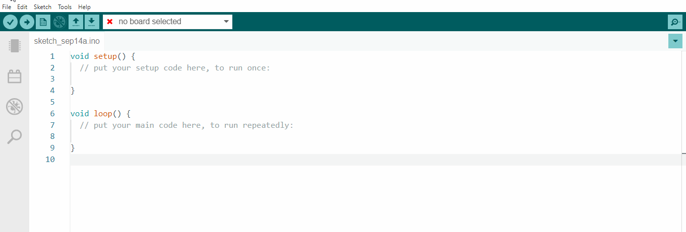
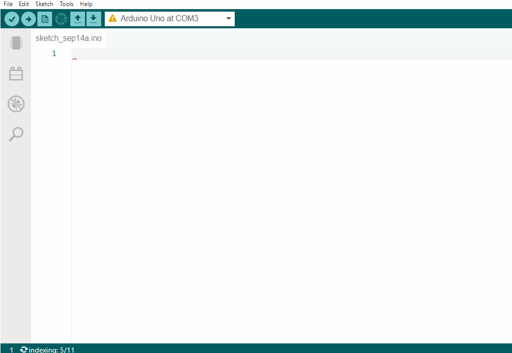
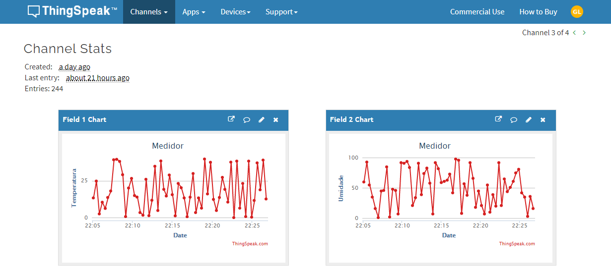
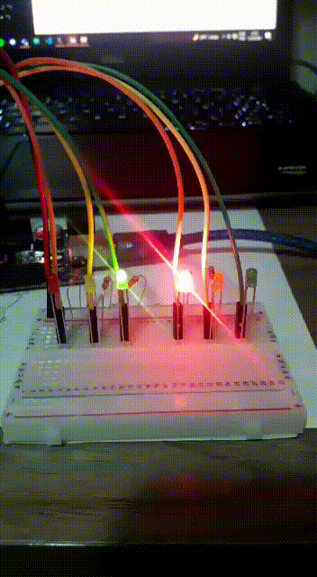

<h1 align="center">
  Arduino IoT - Leitor de Temperatura e Umidade
</h1>

<p align="center">
  
</p>

## Indice
- [Resumo do projeto](#summary)
- [Tecnologias e Ferramentas](#technologies)
- [Montagem do circuito](#circuit)
- [Como rodar a aplicação](#project)
- [Resultados](#result)

<br/>


<a name="summary"></a>
## Resumo do projeto 📝

<p> 
Projeto tem como objetivo enviar dados de temperatura e de umidade para a plataforma IoT - <a href="https://thingspeak.com/">ThingSpeak</a> - e fazer a leitura desses dados em tempo real através do Arduino com o protocolo pyFirmata. Além disso, foi montado um circuito de leds que demosntram a seguinte leitura:
  
- Temperatura entre 0° C a 15°C, acende LED verde no Arduino; Acima de 15°C até 30°C, acende LED amarelo; Acima de 30°C, acende LED vermelho.
- Umidade entre 0% a 50%, acende LED vermelho no Arduino; Acima de 50% até 75%, acende LED amarelo; Acima de 75%, acende LED verde.
  
OBS: O arduino vai fazer a leitura dos dados enviados no ThingSpeak através de um programa "Fake", ou seja, uma função random foi inserida no código para jogar dados aleatórios para fins de aprendizagem. 
</p>

<br />

<a name="technologies"></a>
## Tecnologias e Ferramentas 💻
- Python;
- Pyfirmata;
- Plataforma ThingSpeak;
- IDE Arduino;
- Visual Studio Code;

<br />

<a name="circuit"></a>
## Montagem do circuito 🛠

Para a montagem foram utilizados:
  - Arduino UNO;
  - Protoboard;
  - 6 Leds (2 vermelhos, 2 amarelos e 2 verdes);
  - 6 resistores de 220 ohms;

<p align="center">
  
</p>
  
<br />

<a name="project"></a>
## Como rodar a aplicação ▶

### Configurações básicas

1. Caso não tenha python instalado em seu dispositivo, baixe clicando <a href="https://www.python.org/downloads/" >Aqui.</a>

2. Instalando bibliotecas:

Para rodar python no Arduino, instale o protocolo pyFirmata:
```
pip install pyFirmata
```

Para criar a comunicação com a internet, instale a biblioteca requests 
```
pip install requests
```

3. Caso não tenha instalado a IDE do Arduino, baixe clicando <a href="https://www.arduino.cc/en/software" >Aqui</a>

4. Crie uma conta na plataforma ThingSpeak: https://thingspeak.com/ e depois siga o tutorial a seguir para criar um canal onde a aplicação vai rodar:



### Colocando em prática

Feito estas configurações e tendo montado o circuito, é hora de por o projeto em prática:

1. No seu terminal, clone o projeto:
```
git clone https://github.com/LuisLoschi/Leitor-de-Temperatura-e-Umidade-com-Arduino.git 
```
2. Plugue o Arduino no seu dispositivo;

3. Abra a IDE do arduino e siga estes passos:
    - Localizar qual porta USB está o Arduino na IDE;
    <br />
    <p align="center" >
      
    </p>
    
    - Rodar o protocolo pyFirmata para que o Arduino possa receber os códigos python;
    <br />
    <p align="center" >
      
    </p>
4. Agora entre na pasta clonada e abra o código na IDE do VScode, e faça os seguintes ajustes:
    - Especificar qual a porta USB está o Arduino;
    - Copiar a chave(API KEY) do seu canal criado no ThingSpeak;
    
    

<a name="result"></a>
## Resultados 🚀

- Gráficos
<div >
  
</div>


- Circuito ligado
<div >
  
</div>
  
<hr />  
  
<p>
  Pronto ! Agora temos uma aplicação IoT rodando em tempo real, enviando dados e fazendo sua leitura e demonstrando através dos leds se a temperatura e a úmidade estão dentro dos   padrões especificados 🎉
</p>

<br />
 
<p align="center">
  Feito com carinho 💙 por <b>LuisLoschi</b>
</p>


